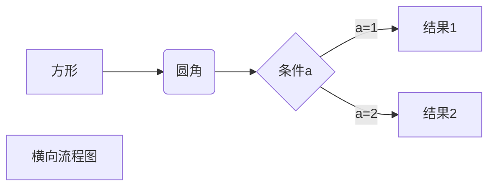

# 一级标题
## 二级标题 
### 三级标题
#### 四级标题
##### 五级标题
# 段落  

ad  
ad

ad

ad
# 文体 

*文体*  
_文体_  
**文体**  
__文体__  
***粗斜体***  
___粗斜体文体___

***
* * *
*****
- - -
---------

~~baidu.com~~

<u>wen</u>

   
创建脚注格式类似这样 [^RUNOOB]。

[^RUNOOB]: 菜鸟教程 -- 学的不仅是技术，更是梦想！！！
  # 列表 
* 第一
+ 第一
- 第一

1. 第一
2. 第二
3. 第三

1. 第一项：
   - 嵌套第一个元素
   - 嵌套第二个元素
# 区块引用  

> 区块引用  
> 菜鸟教程  
> 学的不仅是技术更是梦想

> 最外层
>>第二层
>>> 第三层

> 区块中使用列表  
>1.第一项
>2.第二项
>+ 第一项
>+ 第二项
>+ 第三项

* 第一项
     > 菜鸟教程  
    > 学的
    * 第二项

# 代码
`printf()`函数  
   * 代码区块  
         <?php  
   echo  
   test>  
   }   

 # 链接

 <https://www.runoob.com>

这是一个链接[百度](https://www.baidu.com/s?word=%E7%99%BE%E5%BA%A6&tn=site888_3_pg&lm=-1&ssl_s=1&ssl_c=ssl1_175bf80e432)

 这个链接用 1 作为网址变量 [Google][1]  
这个链接用 runoob 作为网址变量 [Runoob][runoob]  
然后在文档的结尾为变量赋值（网址）  
   [1]: http://www.google.com/  
  [runoob]: http://www.runoob.com/  

  # 图片
  ![alt 图片]（https://timgsa.baidu.com/timg?image&quality=80&size=b9999_10000&sec=1605246610356&di=acc29139bc32cd074215538dbc4bff39&imgtype=0&src=http%3A%2F%2Fa3.att.hudong.com%2F55%2F22%2F20300000929429130630222900050.jpg "alt"）

  这个链接用 1 作为网址变量 [RUNOOB][1].  
然后在文档的结尾为变量赋值（网址）  
[1]: http://static.runoob.com/images/runoob-logo.png

# 表格
|   表头    |  表头 |  
|   ----    |  ---- |
|   单元格   | 单元格|
|   单元格   | 单元格| 

| 左对齐 | 右对齐 | 居中对齐 |
| :-----| ----: | :----: |
| 单元格 | 单元格 | 单元格 |
| 单元格 | 单元格 | 单元格 |  
   
  # 高级技巧  

<kbd>Ctrl</kcd>+<kbd>Alt</kbd>+<kbd>Del</kbd>重启电脑

**弟弟**  
\*\* 弟弟 \*\*

